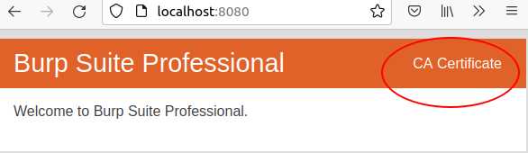

在介绍Android APP抓包之前，我们需要先学习一下浏览器抓包，因为APP抓包是在浏览器抓包的基础上增加了绕过SSL Pinning的操作。

SSL Pinning就是证书绑定，是将服务端证书预置到APP，每次请求要对比预置证书和服务端证书的内容。

## 浏览器抓包

通常我们喜欢使用burpsuite来抓包，首先需要下载burpsuite的CA证书，然后将证书导入到浏览器的受信任区。

1. 启动burpsuite后，下载CA

2. 将CA导入浏览器，windows下可以双击证书安装

   

3. 开始愉快的抓包吧

## APP抓包

因为很多APP使用SSL Pinning校验服务端证书，直接使用上述浏览器抓包的方式是不行的，会提示握手失败。

还好我们可以使用[JustTrustMe](https://github.com/Fuzion24/JustTrustMe/releases/tag/v.2) 跳过证书检查。

### 安装JustTrustMe

因为JustTrustMe是基于xposed框架做的，所以要先安装xposed

安装xposed框架需要手机是被ROOT过的，这里建议使用模拟器来做

我这边使用的模拟器是[genymotion](https://www.genymotion.com/download/)，然后使用的 Nexus9的镜像

因为genymotion只提供了x86的镜像，无法安装带ARM架构的库的APP，需要再安装一个对应版本的[指令转换工具](https://github.com/m9rco/Genymotion_ARM_Translation)

启动Nexus9后，安装[xposed框架](https://repo.xposed.info/module/de.robv.android.xposed.installer)，注意，Android5.0以后的版本需要先刷一个TWRP recovery

安装xposed后就可以安装JustTrustMe并勾选启动了

### 安装burpsuite CA证书

1. 浏览器127.0.0.1:8080 或burpsuite 下载drt或crt格式证书.
2. openssl x509 -inform DER -subject_hash_old -in cert-der.crt |head -1  得到HASH值
3. 修改证书名为   hash值.0     9a5ba575.0
4. 上传证书到 /data/36rdf4td.0
5. 复制到系统目录下, mv data/9a5ba575.0 /system/etc/security/cacerts (若:only-read ,执行 mount -o rw, remount /system )

### 开始抓包

在模拟器所在的Host上打开burpsuite，并配置代理监听地址和端口

别忘了，模拟器的网络也要设置代理到burpsuite监听的地址哦，这样就可以抓到模拟器的流量啦！

